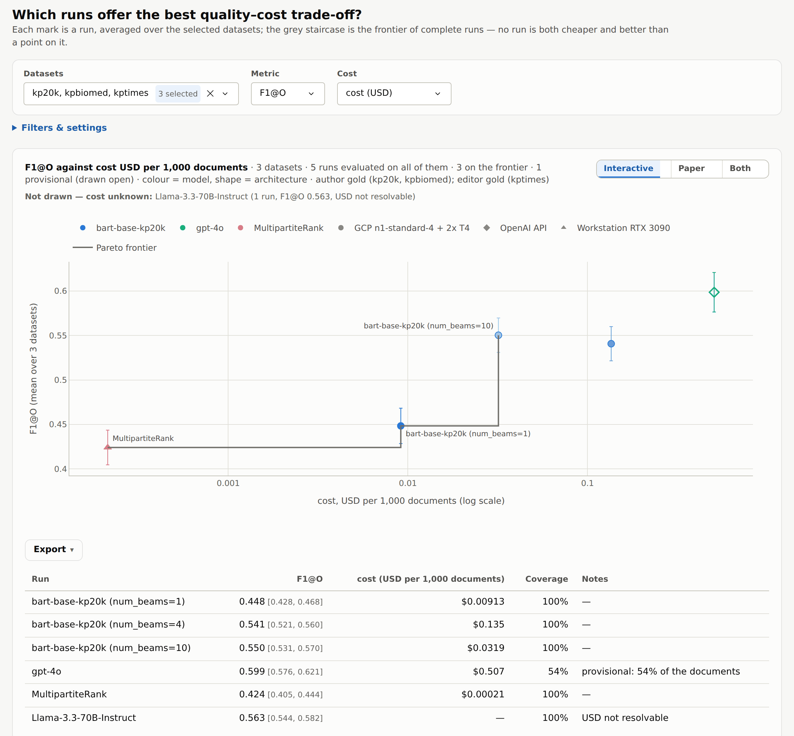

# KPViz

Evaluate keyphrase extraction and generation models on your own data, and
export the figures and tables for your paper.

KPViz reads a folder of cards (datasets, models, architectures) and the runs
produced with them, scores every run with the same conventions, and serves a
local web app to inspect the collections, compare runs, test five research
questions and export PDF/PGF/PNG figures and LaTeX tables with captions.
Source files are read in place; an index and derived statistics are kept in
DuckDB.

Paper: Zahhar, Rodrigues, Mellouli, Travers. *KPViz: A Framework for
Keyphrase Prediction Experiments.* JCDL '26.
[doi:10.1145/3805696.3846518](https://doi.org/10.1145/3805696.3846518) ·
[video](https://youtu.be/WS2iCDfloYM) ·
[code and demo data](https://doi.org/10.5281/zenodo.22789345)

## Run

```bash
git clone https://github.com/saberzahhar/kpviz && cd kpviz
./run.sh
```

`run.sh` checks for Python 3.11 or newer, creates `.venv`, installs the
dependencies (again only when they change), generates `sample_data/` if there
is no `data/`, and opens the app in the browser. Arguments are passed on:

```bash
./run.sh --data /path/to/data --port 8050
```

| Option | Effect |
|---|---|
| `--data PATH` | data tree (default `./data`, else `./sample_data`) |
| `--state PATH` | DuckDB store (default `.kpviz/` next to the data) |
| `--port N`, `--no-browser` | where to serve; do not open a browser |
| `--workers N` | scan processes (default: all cores) |
| `--token-scope eval` | model-token counts for evaluation splits only |
| `--gold-scope all` | per-keyphrase gold rows for training splits too |
| `--offline` | no network; uncached tokenizers become flagged approximations |

Manual install: `python -m venv .venv`, activate it, then
`pip install -r requirements.txt -c constraints.txt` and `kpviz`.
Optional: a TeX distribution (PGF export and TeX-typeset figures), and
`HF_TOKEN` for gated Hugging Face tokenizers. The full demo tree (5 datasets, 7 models,
3 architectures, 75 runs) is on
[Zenodo](https://doi.org/10.5281/zenodo.22789345); place it as `data/`.

## Data layout

Everything is driven by the tree; nothing about your datasets, models or
costs is hard-coded.

```
data/
  documents/document.{dataset}.json      dataset card
  documents/document.{dataset}.jsonl     the collection, one document per line
  models/model.{model}.json              model card (with its inference-parameter schema)
  architectures/architecture.{arch}.json cost variables and rates
  insights/scores.jsonl                  optional: document similarity pairs
  inferences/{dataset}/{model}/{arch}/{run}/
      run_{run}.json                     the parameters the run used
      batch_00000.json                   optional: batch metadata (timestamps, batch costs)
      batch_00000.jsonl                  predictions, one document per line
```

Cards are JSON with `//` and `/* */` comments allowed. Examples, trimmed:

```jsonc
// documents/document.semeval-2010.json
{ "description": "SemEval-2010 scholarly documents",
  "metadata":    { "split": { "type": "split" } },
  "document":    { "title+full-text": { "type": ["title", "body"], "languages": ["en"] } },
  "annotations": { "author": { "type": "author", "languages": ["en"] },
                   "reader": { "type": "reader", "languages": ["en"] } } }

// one line of documents/document.semeval-2010.jsonl
{ "_id": "C-41", "metadata": { "split": "test" },
  "sections":    [ { "field": "title+full-text", "content": "…" } ],
  "annotations": [ { "annotator": "author", "keyphrases": ["grid computing", "…"] } ] }

// models/model.bart-base-kp20k.json
{ "name": "bart-base-kp20k", "backend": "transformers", "supervision": ["kp20k"],
  "capabilities": { "extractive": true, "abstractive": true },
  "inference": {
    "num_beams":      { "type": "int", "min": 1 },
    "input_max_size": { "type": "context_window", "tokenizer": "transformers[facebook/bart-base]",
                        "min": 1, "max": 1024, "default": 1024 } } }

// architectures/architecture.api.json
{ "arch_id": "openai_api", "kind": "api",
  "variables": { "input_tokens":  { "unit": "token", "level": "document",
                                    "tokenizer": "tiktoken[o200k_base]" },
                 "output_tokens": { "unit": "token", "level": "document",
                                    "tokenizer": "tiktoken[o200k_base]" } },
  "rates": { "usd": { "input_tokens": 2.5e-6, "output_tokens": 1e-5 } } }

// inferences/…/run_04b902a7.json, then one line of a batch_*.jsonl
{ "parameters": { "num_beams": 4, "input_max_size": 512 } }
{ "_id": "C-41", "inferences": ["grid computing", "…"],
  "costs": { "input_tokens": 1430, "output_tokens": 31 } }

// insights/scores.jsonl (one pair per line)
{ "dataset_a": "kp20k", "doc_id_a": "…", "dataset_b": "kpbiomed", "doc_id_b": "…",
  "score": 0.93, "label": "near-duplicate" }
```

What KPViz does with them:

- **Run parameters** are checked against the model card: a missing one takes
  the card's default, an illegal one is flagged, never dropped.
- **Folder names** find their card by file name, then by declared id or name.
  A run whose card is missing stays usable; what needs the card (cost,
  validation) is shown as unknown.
- **Costs** are the architecture's linear rates applied to the variables the
  runs report, per document or per batch. Nothing is invented: a cost that
  cannot be resolved is listed as unknown, never drawn as zero.
- **Tokenizers** are `transformers[<owner>/<repo>]`,
  `transformers[file:/path/tokenizer.json]` or `tiktoken[<encoding>]`
  (`llama3`, `llama-3.3` and similar names resolve to the Llama 3
  tokenizer). Assets are downloaded once and cached; a tokenizer that cannot
  be loaded is replaced by a flagged approximation, with the reason on the
  Overview page.
- **Problems** (unreadable cards, malformed lines, repeated document ids,
  duplicate or empty gold keyphrases, a detected language that contradicts
  the declared one) are counted and listed under *Needs attention* on the
  Overview page, never silently ignored.

## The app

| Page | Content |
|---|---|
| Overview | scan progress, catalog, coverage (model × dataset), issues found in the data |
| Datasets | lengths, PRMU classes, keyphrase length and POS per split; documents with the present gold marked; per-run score explanation |
| Models, Architectures | cards, runs checked against the card, scores per dataset, costs |
| Insights | five workbenches, each a figure, a table and an export |

| | Workbench | Question |
|---|---|---|
| RQ1 | Dataset agreement | Do scores on one dataset track scores on another? |
| RQ2 | Data quality | How do flagged documents change the score? |
| RQ3 | Context windows | How much gold does a bounded input window put out of reach? |
| RQ4 | Quality vs. cost | Which runs offer the best quality–cost trade-off? |
| RQ5 | Hyperparameters | Does a hyperparameter change the score? |



- **Figures.** Each figure can be shown interactive, as printed, or both
  side by side. The printed view is the exported PDF (typeset by TeX in the
  venue's fonts when TeX is installed) at the paper's column width, with its
  caption. Some figures have alternative formats: document lengths as
  overlaid or side-by-side histograms or outlines, PRMU classes as stacked
  bars or pies, model scores as bars or dots.
- **Encoding.** A model keeps one colour on every page and in every export;
  its runs are shades of it; an architecture keeps one marker shape. PRMU
  classes are green, yellow, orange and red (present → unseen).
- **Interaction.** Hover a series to single it out, click a legend entry to
  hide it, drag to zoom, double-click to reset. Each workbench has its own
  URL (`/insights#rq1` … `#rq5`). **P** toggles presentation mode.
- **Statistics.** One *Methods* setting for all workbenches: rank tests
  (Wilcoxon, Mann–Whitney, Friedman), mean tests (paired t, Welch t,
  RM-ANOVA) or resampling (permutation, bootstrap); Holm, Bonferroni or
  Benjamini–Hochberg; 95 % intervals; effect sizes. Checked against SciPy.
- **Export.** The *Export* menu under each figure downloads PDF, PNG, PGF,
  the LaTeX figure environment (`.tex`) or everything as a zip with
  provenance, and copies the LaTeX figure or booktabs table. Figures are
  drawn at the real column width of article, *ACL, ACM, IEEE, LNCS or
  NeurIPS/ICLR; captions are generated from the configuration and stay
  editable.

## How scores are computed

- **Text**: NFKC-normalised, lowercased, with Windows-1252 bytes mis-read as
  Latin-1 (`d\x92analyse`) repaired. Words are runs of letters, digits and
  combining marks, so accented Latin, Arabic with harakat and Indic scripts
  stay whole; each Chinese or Japanese character is a word. Words are
  stemmed with the Snowball stemmer of their declared language (28
  languages, Porter2 for English; others are matched unstemmed).
- **Predictions** are de-duplicated after stemming, keeping rank order;
  **gold** is de-duplicated per annotation set, and keyphrases with no word
  are dropped (both counted). A `+` between two words separates gold
  variants (`C++` stays whole).
- **Metrics**: P, R and F1 at 5, 10, O (the number of gold keyphrases) and M
  (all predictions); P@k = tp / min(k, #predictions), without padding.
  Scores are per document, then macro-averaged; documents without gold after
  filtering are excluded and counted.
- **PRMU** (Boudin & Gallina, 2021), on stemmed words: **P** the keyphrase
  occurs as a contiguous sequence, in order; **R** all its words occur but
  not as that sequence; **M** some occur; **U** none. A contiguous
  occurrence stays inside one section and does not cross a separating
  punctuation mark (one next to a space, like a comma or full stop);
  word-internal marks (`e-commerce`, `and/or`, `l'analyse`) do not break it.
  A PRMU filter restricts the gold only: every prediction still counts.
- **One line per document**: a repeated document id in a collection, or a
  document predicted twice by a run, keeps its first line; both are counted
  (`duplicate_doc_ids`, `duplicate_docs`).

Every caption states these conventions.

## Development

```bash
pip install -r requirements-dev.txt -c constraints.txt
python -m pyflakes kpviz tests tools app.py
python -m pytest tests -q -rs
```

The tests generate their own data, check every score against an independent
implementation, verify that worker count and incremental scans never change a
number, and compile every export in article, IEEEtran, llncs and acmart.
[docs/architecture.md](docs/architecture.md) describes the scanner, the store
and the app; [docs/design.md](docs/design.md) the interface conventions;
[docs/demo.md](docs/demo.md) a five-minute demo. Contributions:
[CONTRIBUTING.md](CONTRIBUTING.md).

## Citation

```bibtex
@inproceedings{zahhar2026kpviz,
  author    = {Zahhar, Saber and Rodrigues, Christophe and Mellouli, N{\'e}dra and Travers, Nicolas},
  title     = {{KPViz}: A Framework for Keyphrase Prediction Experiments},
  booktitle = {The 2026 ACM/IEEE Joint Conference on Digital Libraries (JCDL '26)},
  year      = {2026},
  publisher = {Association for Computing Machinery},
  address   = {New York, NY, USA},
  doi       = {10.1145/3805696.3846518}
}
```

## License

[Apache-2.0](LICENSE)
