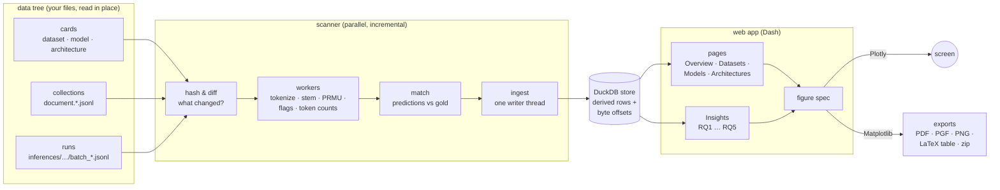

# How KPViz works

KPViz has two halves: a **scanner** that turns a data tree into an analytical
store, and a **web app** that reads that store. They share one rule: the raw
files are never copied. The store keeps derived facts and byte offsets, so a
document or a prediction is always read back from your file.

## The scanner

| Step | Module | What happens |
|---|---|---|
| Find & diff | `scanner.py` | Every file is identified by size, mtime and (when those moved) a content hash. Only new or changed collections and runs are re-derived; a deleted file takes its rows with it. |
| Read cards | `cards.py` | The *only* place that interprets the card schema. JSONC comments, alternative spellings and missing optional fields are normalised here, once. |
| Derive documents | `derive.py` | In a worker pool: NFKC text, Unicode word tokens, Snowball stems, PRMU class per gold keyphrase (contiguous, section-bound), quality flags (language mismatch, missing sections), document lengths in words and in every declared tokenizer. |
| Match runs | `scanner.py`, `metrics.py` | Predictions are normalised and stemmed like the gold; the store keeps, per (run, document, annotation set), the ranks of the correct predictions and the gold keyphrase each one hit. Every P/R/F1 at any cut-off and under any gold filter is then a count, never a re-match. |
| Price runs | `costs.py` | The architecture's linear rates applied to the variables the runs report, per document or per batch. What cannot be resolved stays unknown. |
| Ingest | `ingest.py`, `db.py` | Workers write NDJSON spill files; one writer thread bulk-loads them. Aggregates for the pages are computed once per scan. |

A scan publishes a new **catalog version** only when it completes, so the app
never shows a half-written store. The CPU and memory budget (worker count,
DuckDB threads, nested thread pools) comes from one place, `config.py`, which
reads cgroup and affinity limits (`hostinfo.py`). `docs/PERFORMANCE_PLAN.md`
records the measurements behind these choices.

## The app

**Only what is on screen computes.** Every page and every workbench stays
mounted, so their controls keep their state across navigation. A clientside
callback (`kpviz/assets/route.js`) turns the URL into one visibility flag per page
and per workbench; a server callback does nothing unless its own flag is set.
Switching tabs never reaches the server, and each workbench lives in the URL
hash (`/insights#rq3`), so reloads, the Back button and pasted links land on
the same view.

**One figure, two renderers.** A workbench computes a *figure spec*, a plain
JSON description of the chart (`figures.py`). The screen draws it with
Plotly; an export draws the same spec with Matplotlib at the venue's real
column width. What you download is what you saw, with fonts sized for print.

**Statistics are shared.** One Methods setting (tests, correction,
intervals, resamples) applies to every workbench, its captions and its
exported tables, so a paper cannot mix procedures by accident. The kernels
in `stats.py` are checked against SciPy in the test suite.

**Captions write themselves.** Each workbench composes its caption from the
configuration in force (metric, datasets, gold, filters, tests) and the
matching conventions. An edited caption is never overwritten by a recomputed
figure; the app offers the new one instead.

## Modules at a glance

| Module | Role |
|---|---|
| `cli.py` | Command line: settings, first scan, server |
| `appfactory.py` | App frame, routing, export callbacks |
| `pages/` | One module per page; `pages/rq/` one per research question |
| `ui.py` | Shared building blocks (cards, tables, controls, export bar) |
| `figures.py` | Figure specs → Plotly and Matplotlib |
| `export.py` | PDF / PGF / PNG, booktabs tables, bundles with provenance |
| `metrics.py` | Scores from the stored match primitives, cached per catalog version |
| `stats.py` | Tests, corrections, intervals, effect sizes |
| `naming.py` | Display names, run labels, the colour and shape of every entity |
| `highlight.py` | Where a gold keyphrase occurs in a text, found as the scorer finds it |
| `textproc.py` | Normalisation, tokenisation, stemming, tokenizers |
| `scanner.py`, `derive.py`, `ingest.py`, `db.py` | The scan and the store |
| `cards.py`, `costs.py` | The data contract and cost resolution |
| `config.py`, `hostinfo.py`, `diag.py` | Resource budget and fast-path diagnostics |
