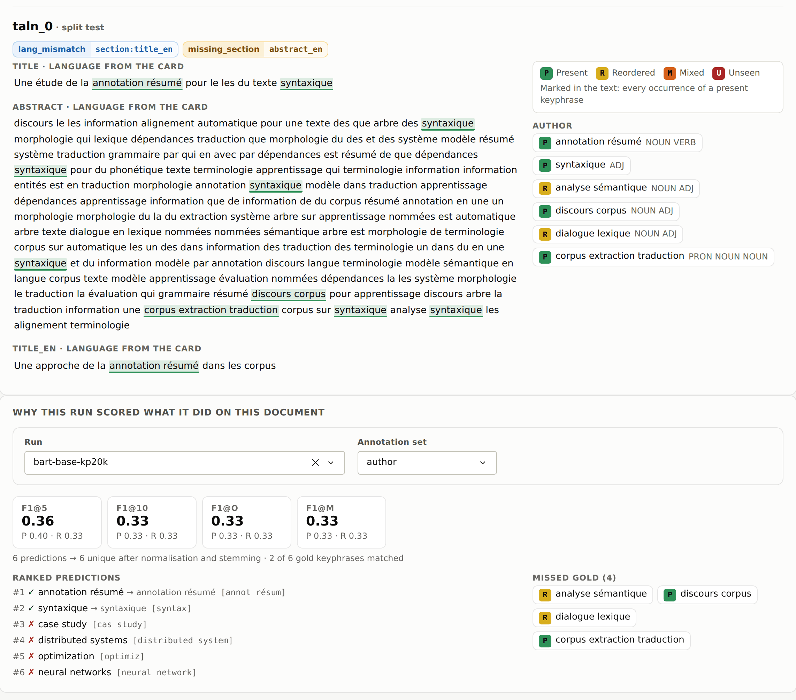
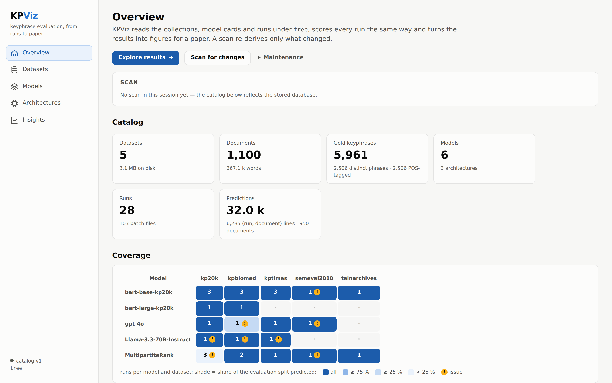

# Interface design

KPViz is used in two places: at a desk, reading results closely, and on a
projector, showing them to a room. The interface is built for both from one
set of rules. This page records those rules and the decisions behind them.

## Principles

1. **Say what was computed.** Every figure has a scope line above it
   (metric, datasets, number of systems, gold, filters) taken from the result
   itself, not from the controls. A screenshot identifies itself.
2. **Never hide a problem.** An unknown cost is listed as unknown, not drawn
   at zero. A run with a missing card stays in, flagged. A tokenizer that
   fell back to an approximation says so on the Overview page.
3. **Show the evidence.** The document inspector marks each present gold
   keyphrase in the text, found by the same code path the scorer uses
   (`highlight.py`), and explains a run's score prediction by prediction.

   
4. **Few controls in view.** Each workbench shows what most people change;
   the rest is folded under *Filters & settings*. Settings that do not apply
   to the workbench on screen are disabled, with the reason.
5. **Colour carries identity, never alone.** A model keeps one hue
   everywhere; its runs are shades of it; an architecture keeps one marker
   shape. Status always comes with an icon and a word.

## Tokens

Every colour, font size and spacing is a CSS custom property on `:root` in
`kpviz/assets/kpviz.css`: surfaces and ink, one accent, status colours,
the PRMU ramp, a type scale and a spacing scale. Pages use the tokens, not
raw values. Presentation mode redefines the type scale only.

## Colour

| Palette | Job | How it was chosen |
|---|---|---|
| Models (8 slots, `naming.PALETTE`) | identity | fixed order, never cycled; a 9th model is grey "other" |
| Splits (training, validation, testing) | identity | validated as a categorical set: lightness band, chroma floor, colour-vision separation (worst pair ΔE 13.8), 3:1 contrast |
| PRMU (P → U) | order | green, yellow, orange, red: verbatim → absent; validated as a set, and the letter is always printed on the swatch |
| Conditions (all vs. a subset) | comparison | neutral greys, darker = the subset under test, so hue always means the model |
| Coverage | magnitude | one hue, four steps |
| Correlation (RQ1) | polarity | two hues and a neutral midpoint |
| Status | state | reserved: red error, amber warning, grey note |

The PRMU colours exist twice, in Python for the figures and in CSS for the
page, and a test keeps them equal. Every text colour meets WCAG 2.2 AA
(4.5:1) on its background; the ratios are listed at the top of the
stylesheet.

## Charts

- Gridlines on the value axis only. Log axes get one gridline per decade.
- Bars at most about 26 px thick, whatever the number of categories.
- Costs are shown in a readable unit (per document, per 1,000 or per million
  documents), never in scientific notation.
- Marker outlines in the model's own hue. Provisional runs (incomplete
  coverage) are drawn open.
- Direct labels are placed by a small solver that avoids markers, whiskers,
  the Pareto staircase and each other.
- Heatmap cells print their value in white or ink, whichever contrasts.
- Empty results never draw an empty grid: the reason and what to change
  take the figure's place.

## Interaction

- Hovering a series fades the others: a model with all its runs, a split,
  or a PRMU class can be followed across a crowded figure.
- A changed setting moves the marks to their new place (350 ms) instead of
  redrawing the figure; zoom and hidden legend entries are kept.
- Click a legend entry to hide it, double-click to keep only it; drag to
  zoom, double-click the plot to reset.
- Tooltips carry the exact values, the interval and the sample size.

## Accessibility

- A skip link, landmarks (`nav`, `main`), headings in order (H1 per page,
  H2 per section).
- The Insights tabs follow the WAI-ARIA tabs pattern: arrow keys, Home and
  End move between tabs; `aria-selected` and a roving `tabindex` follow the
  active one.
- Every form control is named after its visible label; figures are named
  `role="figure"` regions.
- A clickable table row holds a real button in its first cell.
- Status messages (scan progress, export status) are live regions.
- Motion is off when the system asks for reduced motion.

## Presentation mode

Press **P** (or open any page with `?present`). The page's type scale grows
by about a quarter and every Plotly figure's fonts grow with it, in the
browser only: the server, the captions and the exports are unchanged. The
setting is remembered per browser. The deep links `/insights#rq1` …
`#rq5` let a presenter pre-open each workbench.

## Decisions not taken

- **No dark theme.** The figures are drawn for white paper, and the screen
  shows what the PDF will look like. A dark theme would either show figures
  that differ from their exports or paint white rectangles on a dark page.
  Revisit if people ask to *read* in KPViz more than to *prepare figures*
  with it.
- **No skeleton screens.** Updates take a fraction of a second; the previous
  figure stays readable under a light overlay that appears only after
  400 ms. A skeleton would replace a correct figure with a placeholder.
